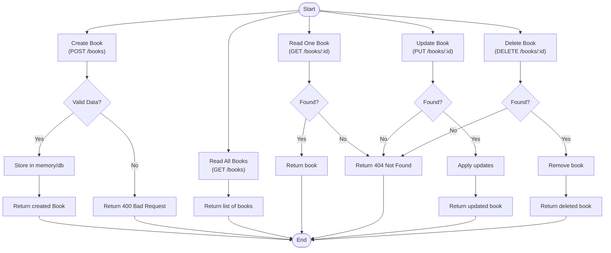
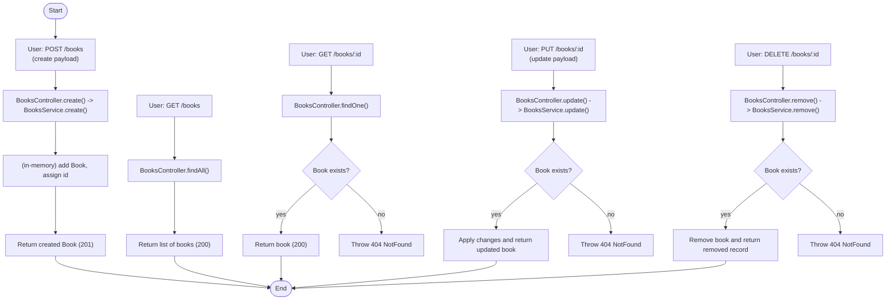

## Books CRUD - Activity Diagram

```mermaid
flowchart TD
  Start([Start]) --> Create["Create Book\n(POST /books)"]
  Create --> VerifyCreate{Valid Data?}
  VerifyCreate -- Yes --> StoreCreate[Store in memory/db]
  StoreCreate --> ReturnCreate[Return created Book]
  VerifyCreate -- No --> ReturnCreateErr[Return 400 Bad Request]

  Start --> ReadAll["Read All Books\n(GET /books)"]
  ReadAll --> ReturnAll[Return list of books]

  Start --> ReadOne["Read One Book\n(GET /books/:id)"]
  ReadOne --> Found?{Found?}
  Found? -- Yes --> ReturnOne[Return book]
  Found? -- No --> Return404[Return 404 Not Found]

  Start --> Update["Update Book\n(PUT /books/:id)"]
  Update --> FoundUpd?{Found?}
  FoundUpd? -- Yes --> ApplyUpd[Apply updates]
  ApplyUpd --> ReturnUpd[Return updated book]
  FoundUpd? -- No --> Return404

  Start --> Delete["Delete Book\n(DELETE /books/:id)"]
  Delete --> FoundDel?{Found?}
  FoundDel? -- Yes --> Remove[Remove book]
  Remove --> ReturnDel[Return deleted book]
  FoundDel? -- No --> Return404

  ReturnCreate --> End([End])
  ReturnCreateErr --> End
  ReturnAll --> End
  ReturnOne --> End
  Return404 --> End
  ReturnUpd --> End
  ReturnDel --> End
```

Save this diagram as the algorithm flow for Books CRUD.
**Books CRUD Activity Diagram**

```mermaid
flowchart TD
  Start([Start]) --> CreateReq["User: POST /books\n(create payload)"]
  CreateReq --> CreateService["BooksController.create() -> BooksService.create()"]
  CreateService --> Persist["(in-memory) add Book, assign id"]
  Persist --> RespondCreate["Return created Book (201)"]
  RespondCreate --> End([End])

  %% Read flow
  ReadAllReq["User: GET /books"] --> ReadAllService["BooksController.findAll()"]
  ReadAllService --> RespondAll["Return list of books (200)"]

  ReadOneReq["User: GET /books/:id"] --> ReadOneService["BooksController.findOne()"]
  ReadOneService --> IfFound{Book exists?}
  IfFound -->|yes| RespondOne["Return book (200)"]
  IfFound -->|no| Respond404["Throw 404 NotFound"]

  %% Update flow
  UpdateReq["User: PUT /books/:id\n(update payload)"] --> UpdateService["BooksController.update() -> BooksService.update()"]
  UpdateService --> IfFoundUpd{Book exists?}
  IfFoundUpd -->|yes| PersistUpd["Apply changes and return updated book"]
  IfFoundUpd -->|no| Respond404Upd["Throw 404 NotFound"]

  %% Delete flow
  DeleteReq["User: DELETE /books/:id"] --> DeleteService["BooksController.remove() -> BooksService.remove()"]
  DeleteService --> IfFoundDel{Book exists?}
  IfFoundDel -->|yes| PersistDel["Remove book and return removed record"]
  IfFoundDel -->|no| Respond404Del["Throw 404 NotFound"]

  RespondAll --> End
  RespondOne --> End
  PersistUpd --> End
  PersistDel --> End

```

File: docs/books-crud.md
